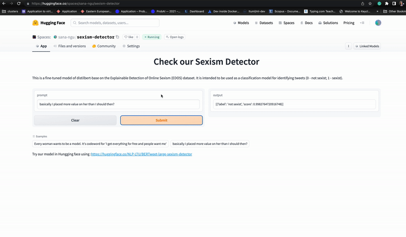

# semeval23-task10-sexism-detection

To Train the model, you need to run

CUDA_VISIBLE_DEVICES=7 python3 run_train.py --model_name <model cheackpoint>  --learning_rate 1.6e-5 --epoch 4.0 --output_dir <ouput> --data_dir <data path>

To predict and creat submission .csv use:

CUDA_VISIBLE_DEVICES=7 python3 run_predict.py --model_name <model cheackpoint> --output_dir <ouput>--results_dir <directory for the F1, acuracy results>

The results file then will have: 

 2023-02-12 22:36:29 
```
              precision    recall  f1-score   support

  not sexsit       0.93      0.94      0.93      1514
      sexist       0.82      0.76      0.79       486

    accuracy                           0.90      2000
   macro avg       0.87      0.85      0.86      2000
weighted avg       0.90      0.90      0.90      2000
```
tn 1430, fp 84, fn 115, tp 371```

To use the code for the test set without labels (you need to modify the run_predict.py and remove the classification report )


